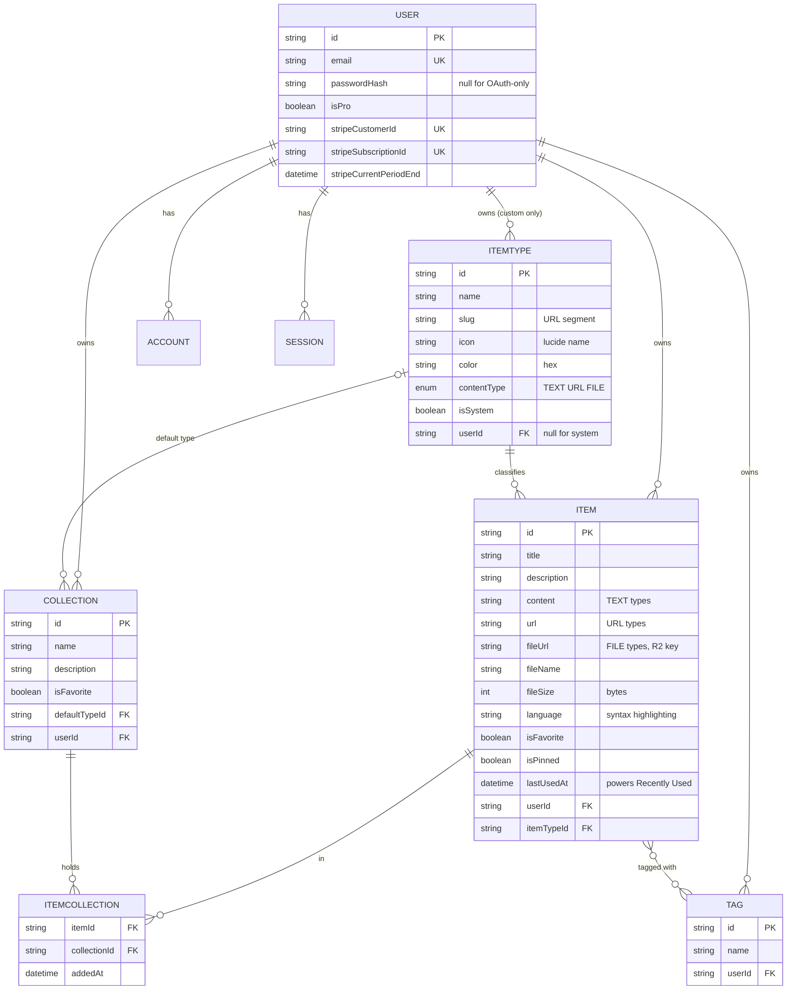
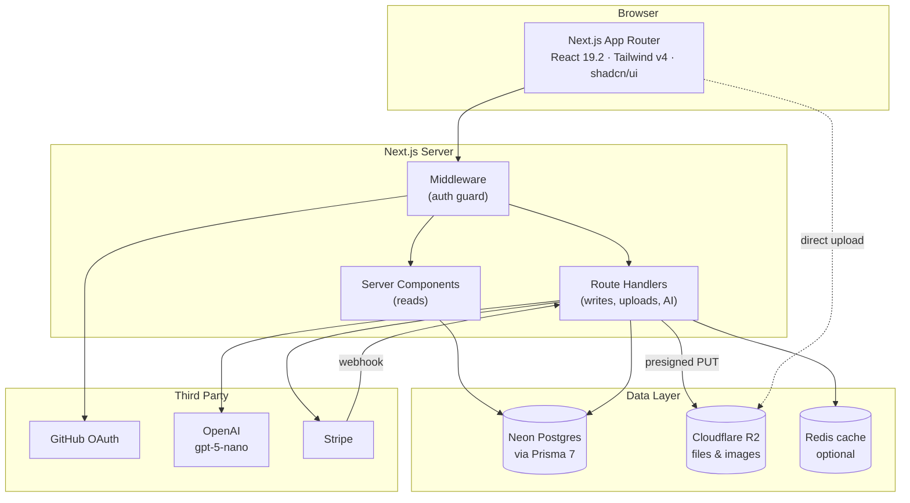
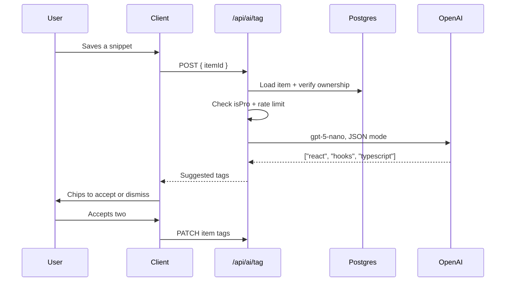

# DevStash — Project Overview

> One fast, searchable, AI-enhanced hub for everything a developer keeps scattered: snippets, prompts, notes, commands, links, and files.

**Status:** Planning / pre-build
**Type:** Freemium SaaS (single Next.js codebase)
**Last updated:** August 2026

---

## Table of Contents

1. [Problem & Solution](#1-problem--solution)
2. [Target Users](#2-target-users)
3. [Feature Scope](#3-feature-scope)
4. [Item Types Reference](#4-item-types-reference)
5. [Data Model](#5-data-model)
6. [Prisma Schema](#6-prisma-schema)
7. [Routes & App Structure](#7-routes--app-structure)
8. [Architecture](#8-architecture)
9. [Tech Stack](#9-tech-stack)
10. [Monetization](#10-monetization)
11. [UI/UX](#11-uiux)
12. [Open Questions](#12-open-questions)
13. [Build Order](#13-build-order)

---

## 1. Problem & Solution

### The Problem

Developer knowledge lives in eight different places at once:

| What | Where it ends up |
| --- | --- |
| Code snippets | VS Code scratch files, Notion |
| AI prompts | Buried in old chat threads |
| Context files | Random project folders |
| Useful links | Browser bookmarks (never revisited) |
| Docs & notes | Wherever they were written |
| Commands | `.txt` files, `~/.bash_history` |
| Project templates | GitHub Gists |

The cost is context switching, lost knowledge, and inconsistent workflows across projects.

### The Solution

DevStash is one hub with:

- **Fast capture** — a global drawer, never a full page navigation
- **Fast retrieval** — search across content, titles, tags, and types
- **Flexible organization** — typed items, many-to-many collections
- **AI on top** — auto-tagging, summaries, code explanation, prompt optimization

---

## 2. Target Users

| Persona | Primary need | Types they lean on |
| --- | --- | --- |
| **Everyday Developer** | Grab snippets, commands, and links fast | snippet, command, link |
| **AI-first Developer** | Store prompts, contexts, system messages, workflows | prompt, file, note |
| **Content Creator / Educator** | Reusable code blocks, explanations, course notes | snippet, note, image |
| **Full-stack Builder** | Patterns, boilerplates, API examples | snippet, file, link |

**Design implication:** every persona above is a *heavy re-user* of saved material, not just a saver. Retrieval speed matters more than capture polish — which is why "Recently used", pinning, and search rank above the editor in priority.

---

## 3. Feature Scope

### MVP (v1)

- [ ] Auth: email/password + GitHub OAuth
- [ ] Item CRUD in a drawer (create, edit, delete, copy)
- [ ] Seven system item types
- [ ] Collections + many-to-many item membership
- [ ] Search across content, title, tags, type
- [ ] Favorites (items + collections), pin to top, recently used
- [ ] Markdown editor with syntax highlighting for text types
- [ ] Import code from a local file
- [ ] Dark mode (default) + light mode
- [ ] Free/Pro plan scaffolding — gates in place, everything unlocked in dev

### v1.1

- [ ] File & image upload to R2
- [ ] Export (JSON / ZIP)
- [ ] Stripe checkout + billing portal + webhooks
- [ ] AI: auto-tag suggestions, summaries, explain code, prompt optimizer

### Later

- [ ] Custom item types
- [ ] Public sharing of an item or collection
- [ ] Browser extension / CLI / VS Code extension for capture
- [ ] Team workspaces

---

## 4. Item Types Reference

Seven system types ship immutable (`isSystem: true`, `userId: null`). Custom types come later as a Pro feature.

| Type | Slug | Content | Color | Hex | Lucide Icon | Tier |
| --- | --- | --- | --- | --- | --- | --- |
| Snippet | `snippets` | TEXT | 🔵 Blue | `#3b82f6` | `Code` | Free |
| Prompt | `prompts` | TEXT | 🟣 Purple | `#8b5cf6` | `Sparkles` | Free |
| Command | `commands` | TEXT | 🟠 Orange | `#f97316` | `Terminal` | Free |
| Note | `notes` | TEXT | 🟡 Yellow | `#fde047` | `StickyNote` | Free |
| Link | `links` | URL | 🟢 Emerald | `#10b981` | `Link` | Free |
| File | `files` | FILE | ⚫ Gray | `#6b7280` | `File` | **Pro** |
| Image | `images` | FILE | 🩷 Pink | `#ec4899` | `Image` | **Pro** |

> ⚠️ **Contrast check:** `#fde047` (Note yellow) fails WCAG AA as a text color on a dark background and is nearly invisible on light. Use it for borders/badges only, or darken to `#eab308` when it carries text.

Define these once and import everywhere — never hardcode a hex in a component:

```ts
// src/lib/item-types.ts
import { Code, Sparkles, Terminal, StickyNote, File, Image, Link } from "lucide-react";

export const ITEM_TYPES = {
  snippet: { slug: "snippets", label: "Snippet", color: "#3b82f6", icon: Code,       contentType: "TEXT", pro: false },
  prompt:  { slug: "prompts",  label: "Prompt",  color: "#8b5cf6", icon: Sparkles,   contentType: "TEXT", pro: false },
  command: { slug: "commands", label: "Command", color: "#f97316", icon: Terminal,   contentType: "TEXT", pro: false },
  note:    { slug: "notes",    label: "Note",    color: "#fde047", icon: StickyNote, contentType: "TEXT", pro: false },
  link:    { slug: "links",    label: "Link",    color: "#10b981", icon: Link,       contentType: "URL",  pro: false },
  file:    { slug: "files",    label: "File",    color: "#6b7280", icon: File,       contentType: "FILE", pro: true  },
  image:   { slug: "images",   label: "Image",   color: "#ec4899", icon: Image,      contentType: "FILE", pro: true  },
} as const;
```

The database stays the source of truth for user-created types later; this map is the seed data plus the icon lookup.

---

## 5. Data Model

### Entity Relationship Diagram



### Changes from the original notes

Six things worth fixing before the first migration — a schema change after real data exists is a much worse afternoon than a schema change now.

| # | Change | Why |
| --- | --- | --- |
| 1 | **`contentType` moves from `Item` to `ItemType`** | Original notes have `Item.contentType` as `text \| file`, but the feature spec says a type is text, **url**, or file. Content shape is a property of the *type*, not the item — every snippet is text, every link is a URL. Storing it on `Item` lets the two disagree. |
| 2 | **`ItemType.slug` added** | The spec calls for URLs like `/items/snippets`. Slugs need to be stored and unique, not derived from a display name that users can change. |
| 3 | **`Item.lastUsedAt` added** | "Recently used" is in the feature list with nothing in the schema to support it. `updatedAt` is not a substitute — copying a snippet is a *use*, not an edit. |
| 4 | **`Tag.userId` added + `@@unique([userId, name])`** | Without an owner, tags are global: renaming "react" affects every account, and tag counts leak other users' data. |
| 5 | **Stripe fields expanded** | `stripePriceId` tells you monthly vs annual; `stripeCurrentPeriodEnd` lets you honor a subscription through a cancelled period instead of cutting access instantly. `isPro` becomes a cached mirror updated by webhook, never the source of truth. |
| 6 | **Explicit `onDelete` on every relation** | Deleting a user should clear their items; deleting an ItemType a collection points at should null the `defaultTypeId`, not orphan the row. |

---

## 6. Prisma Schema

> **Prisma 7 notes:** the `prisma-client` generator replaces `prisma-client-js`, `output` is now **required**, a driver adapter is required to connect, and the package must be ESM (`"type": "module"` in `package.json`). Import from your output path (`./generated/prisma/client`), not `@prisma/client`.
> — [Upgrade guide](https://www.prisma.io/docs/guides/upgrade-prisma-orm/v7)

```prisma
// prisma/schema.prisma

generator client {
  provider = "prisma-client"
  output   = "../src/generated/prisma"
}

datasource db {
  provider = "postgresql"
  url      = env("DATABASE_URL")
}

enum ContentType {
  TEXT
  URL
  FILE
}

// ─────────────────────────────────────────────
// USER
// ─────────────────────────────────────────────

model User {
  id            String    @id @default(cuid())
  name          String?
  email         String    @unique
  emailVerified DateTime?
  image         String?
  passwordHash  String? // null for OAuth-only accounts

  // Billing — isPro is a cached mirror of Stripe, synced by webhook
  isPro                  Boolean   @default(false)
  stripeCustomerId       String?   @unique
  stripeSubscriptionId   String?   @unique
  stripePriceId          String?
  stripeCurrentPeriodEnd DateTime?

  accounts    Account[]
  sessions    Session[]
  items       Item[]
  collections Collection[]
  itemTypes   ItemType[] // custom types only
  tags        Tag[]

  createdAt DateTime @default(now())
  updatedAt DateTime @updatedAt
}

// ─────────────────────────────────────────────
// ITEM TYPES
// ─────────────────────────────────────────────

model ItemType {
  id          String      @id @default(cuid())
  name        String // "Snippet"
  slug        String // "snippets" → /items/snippets
  icon        String // lucide icon name, e.g. "Code"
  color       String // hex, e.g. "#3b82f6"
  contentType ContentType @default(TEXT)
  isSystem    Boolean     @default(false)
  sortOrder   Int         @default(0)

  userId String? // null for system types
  user   User?   @relation(fields: [userId], references: [id], onDelete: Cascade)

  items              Item[]
  defaultForColl     Collection[] @relation("CollectionDefaultType")

  createdAt DateTime @default(now())

  @@unique([userId, slug])
  @@index([userId])
}

// ─────────────────────────────────────────────
// ITEMS
// ─────────────────────────────────────────────

model Item {
  id          String  @id @default(cuid())
  title       String
  description String?

  // Exactly one of these is populated, based on itemType.contentType
  content String? @db.Text // TEXT
  url     String? // URL
  fileUrl String? // FILE — R2 object key
  fileName String?
  fileSize Int? // bytes

  language   String? // "typescript", "python" — syntax highlighting
  isFavorite Boolean @default(false)
  isPinned   Boolean @default(false)

  lastUsedAt DateTime? // bumped on copy/open — powers "Recently used"
  createdAt  DateTime  @default(now())
  updatedAt  DateTime  @updatedAt

  userId String
  user   User   @relation(fields: [userId], references: [id], onDelete: Cascade)

  itemTypeId String
  itemType   ItemType @relation(fields: [itemTypeId], references: [id], onDelete: Restrict)

  collections ItemCollection[]
  tags        Tag[]

  @@index([userId, updatedAt(sort: Desc)])
  @@index([userId, lastUsedAt(sort: Desc)])
  @@index([userId, itemTypeId])
  @@index([userId, isPinned, isFavorite])
}

// ─────────────────────────────────────────────
// COLLECTIONS
// ─────────────────────────────────────────────

model Collection {
  id          String  @id @default(cuid())
  name        String
  description String?
  isFavorite  Boolean @default(false)

  // Pre-selects a type in the "new item" drawer for empty collections
  defaultTypeId String?
  defaultType   ItemType? @relation("CollectionDefaultType", fields: [defaultTypeId], references: [id], onDelete: SetNull)

  userId String
  user   User   @relation(fields: [userId], references: [id], onDelete: Cascade)

  items ItemCollection[]

  createdAt DateTime @default(now())
  updatedAt DateTime @updatedAt

  @@unique([userId, name])
  @@index([userId, updatedAt(sort: Desc)])
}

model ItemCollection {
  itemId       String
  collectionId String
  addedAt      DateTime @default(now())

  item       Item       @relation(fields: [itemId], references: [id], onDelete: Cascade)
  collection Collection @relation(fields: [collectionId], references: [id], onDelete: Cascade)

  @@id([itemId, collectionId])
  @@index([collectionId, addedAt(sort: Desc)])
}

// ─────────────────────────────────────────────
// TAGS
// ─────────────────────────────────────────────

model Tag {
  id   String @id @default(cuid())
  name String

  userId String
  user   User   @relation(fields: [userId], references: [id], onDelete: Cascade)

  items Item[]

  createdAt DateTime @default(now())

  @@unique([userId, name])
  @@index([userId])
}
```

<details>
<summary><strong>Auth.js v5 adapter models</strong> (click to expand)</summary>

```prisma
model Account {
  id                String  @id @default(cuid())
  userId            String
  type              String
  provider          String
  providerAccountId String
  refresh_token     String? @db.Text
  access_token      String? @db.Text
  expires_at        Int?
  token_type        String?
  scope             String?
  id_token          String? @db.Text
  session_state     String?

  user User @relation(fields: [userId], references: [id], onDelete: Cascade)

  @@unique([provider, providerAccountId])
  @@index([userId])
}

model Session {
  id           String   @id @default(cuid())
  sessionToken String   @unique
  userId       String
  expires      DateTime

  user User @relation(fields: [userId], references: [id], onDelete: Cascade)

  @@index([userId])
}

model VerificationToken {
  identifier String
  token      String   @unique
  expires    DateTime

  @@unique([identifier, token])
}
```

</details>

### The one unique-constraint gotcha

`@@unique([userId, slug])` on `ItemType` **will not** prevent duplicate system types. Postgres treats `NULL` values as distinct, so two rows with `userId = NULL, slug = "snippets"` both pass the constraint. Add a partial index by hand in a migration:

```sql
-- prisma/migrations/xxxx_system_type_slug_unique/migration.sql
CREATE UNIQUE INDEX "itemtype_system_slug_key"
  ON "ItemType" ("slug")
  WHERE "userId" IS NULL;
```

### Migration workflow

> 🚫 **Never run `prisma db push`. Never alter the database by hand.** Every structural change is a migration, run in dev, then committed, then run in prod.

```bash
# 1. Edit prisma/schema.prisma
# 2. Create + apply the migration locally
npx prisma migrate dev --name add_last_used_at

# 3. Regenerate the client (Prisma 7 outputs into src/, so it's git-ignored)
npx prisma generate

# 4. Commit prisma/migrations/** with the code change

# 5. Deploy — in CI/build step, never interactively
npx prisma migrate deploy
```

Seed the seven system types in `prisma/seed.ts` with fixed IDs so the seed is idempotent across environments.

### Search implementation

Prisma's `contains` maps to `ILIKE`, which is fine for the first few thousand rows and terrible after. Plan for two stages:

**Stage 1 (MVP)** — `ILIKE` across title, content, description, plus a tag join. Add `pg_trgm` for fuzzy matching:

```sql
CREATE EXTENSION IF NOT EXISTS pg_trgm;
CREATE INDEX "item_title_trgm" ON "Item" USING GIN ("title" gin_trgm_ops);
```

**Stage 2** — a generated `tsvector` column with weighted fields, added via raw SQL migration and queried with `$queryRaw`:

```sql
ALTER TABLE "Item" ADD COLUMN "searchVector" tsvector
  GENERATED ALWAYS AS (
    setweight(to_tsvector('english', coalesce("title", '')), 'A') ||
    setweight(to_tsvector('english', coalesce("description", '')), 'B') ||
    setweight(to_tsvector('english', coalesce("content", '')), 'C')
  ) STORED;

CREATE INDEX "item_search_idx" ON "Item" USING GIN ("searchVector");
```

Mark the column `Unsupported("tsvector")?` in the schema so Prisma leaves it alone.

---

## 7. Routes & App Structure

### Page routes

| Route | Purpose |
| --- | --- |
| `/` | Dashboard — pinned, recently used, collection grid |
| `/items` | All items, filterable |
| `/items/[typeSlug]` | Items of one type — `/items/snippets`, `/items/prompts` |
| `/collections` | Collection grid |
| `/collections/[id]` | Single collection with its items |
| `/search` | Full search results with filters |
| `/settings` | Profile, theme, data export |
| `/settings/billing` | Plan, Stripe portal link |
| `/login` · `/register` | Auth |

### API routes

| Route | Methods | Notes |
| --- | --- | --- |
| `/api/auth/[...nextauth]` | — | Auth.js handler |
| `/api/items` | `GET` `POST` | List + create; enforces free-tier item cap |
| `/api/items/[id]` | `GET` `PATCH` `DELETE` | Ownership check on every call |
| `/api/items/[id]/use` | `POST` | Bumps `lastUsedAt` |
| `/api/items/[id]/collections` | `PUT` | Set collection membership |
| `/api/collections` | `GET` `POST` | Enforces free-tier collection cap |
| `/api/collections/[id]` | `GET` `PATCH` `DELETE` | |
| `/api/upload` | `POST` | Returns a presigned R2 URL — Pro only |
| `/api/search` | `GET` | |
| `/api/ai/tag` · `/summarize` · `/explain` · `/optimize` | `POST` | Pro only, rate limited |
| `/api/export` | `GET` | JSON/ZIP — Pro only |
| `/api/stripe/checkout` · `/portal` · `/webhook` | `POST` | Webhook needs the raw body |

### The drawer pattern

Items open in a drawer, but a drawer with no URL can't be shared, bookmarked, or reopened by the back button. Use **intercepting + parallel routes** so `/items/abc123` renders the drawer over the current page on client navigation, and renders a full page on a hard load:

```
src/app/
├── layout.tsx
├── @drawer/
│   ├── default.tsx
│   └── (.)items/[id]/page.tsx    # intercepted → drawer
├── items/
│   ├── [id]/page.tsx             # direct load → full page
│   └── [typeSlug]/page.tsx
├── collections/
├── api/
└── (auth)/
    ├── login/
    └── register/
src/
├── components/
│   ├── ui/           # shadcn primitives
│   ├── items/
│   ├── collections/
│   └── layout/       # sidebar, topbar, command palette
├── lib/
│   ├── auth.ts       # Auth.js config
│   ├── prisma.ts     # singleton client
│   ├── r2.ts         # S3 client for R2
│   ├── ai.ts         # OpenAI wrappers
│   ├── limits.ts     # free-tier gates
│   └── item-types.ts
└── generated/prisma/ # Prisma 7 output, git-ignored
```

> ⚠️ **Next.js 16 breaking change:** `params` and `searchParams` are now Promises. Every dynamic page needs `const { id } = await params;`.

---

## 8. Architecture



**Two things worth noting in that diagram:**

1. **File uploads bypass the server.** The client asks `/api/upload` for a presigned URL, then PUTs directly to R2. Files never pass through a serverless function, so you avoid request body size limits and function timeouts entirely.
2. **Stripe is the source of truth for billing.** `User.isPro` is written *only* by the webhook handler. Nothing else in the app ever sets it.

### AI call flow



Always let the user confirm AI tags rather than applying them silently — wrong tags that appear on their own erode trust in search results.

---

## 9. Tech Stack

| Layer | Choice | Docs |
| --- | --- | --- |
| Framework | Next.js 16 (App Router, Turbopack) | [nextjs.org/docs](https://nextjs.org/docs) · [v16 upgrade](https://nextjs.org/docs/app/guides/upgrading/version-16) |
| UI | React 19.2 | [react.dev](https://react.dev) |
| Language | TypeScript (strict) | [typescriptlang.org](https://www.typescriptlang.org/docs/) |
| Styling | Tailwind CSS v4 | [tailwindcss.com](https://tailwindcss.com/docs) |
| Components | shadcn/ui | [ui.shadcn.com](https://ui.shadcn.com) |
| Icons | lucide-react | [lucide.dev](https://lucide.dev/icons/) |
| Database | Neon Postgres (serverless) | [neon.com/docs](https://neon.com/docs) |
| ORM | Prisma 7 + `@prisma/adapter-neon` | [prisma.io/docs](https://www.prisma.io/docs) |
| Auth | Auth.js v5 (NextAuth) | [authjs.dev](https://authjs.dev) |
| File storage | Cloudflare R2 (S3-compatible) | [developers.cloudflare.com/r2](https://developers.cloudflare.com/r2/) |
| AI | OpenAI `gpt-5-nano` | [platform.openai.com/docs](https://platform.openai.com/docs) |
| Payments | Stripe | [docs.stripe.com](https://docs.stripe.com) |
| Editor | CodeMirror 6 or Monaco | [codemirror.net](https://codemirror.net/) |
| Highlighting | Shiki | [shiki.style](https://shiki.style/) |
| Cache (optional) | Upstash Redis | [upstash.com/docs](https://upstash.com/docs/redis) |

### Stack notes

**Next.js 16** shipped Turbopack as the default bundler and requires Node.js 20+. It also brings Cache Components, file system caching, smarter routing and prefetching, new caching APIs, and React 19.2 features. The React Compiler is stable here — enable it and stop hand-writing `useMemo`.

**Prisma 7** is the Rust-free rewrite. The `output` field is now required in the generator block, and the client is no longer generated into `node_modules` by default. Neon connects through the driver adapter rather than a direct connection string.

**Auth.js v5 gotcha:** the Credentials provider does not work with the database session strategy. Mixing email/password with the Prisma adapter means you must set `session: { strategy: "jwt" }`. Plan for it now — discovering it after building session-dependent features is a rewrite.

**Shiki over Prism/highlight.js** — it uses real TextMate grammars, so highlighting matches VS Code exactly. For a tool developers live inside, that familiarity is worth the bundle cost.

**`gpt-5-nano`** remains available at roughly $0.05 per million input tokens with a 400K context window — cheap enough that auto-tagging every save costs almost nothing. OpenAI's own model guidance now nudges new speed- and cost-sensitive workloads toward its newer small model, so it's worth a quick quality comparison on the prompt-optimizer feature specifically, where nano's shallower reasoning shows most. Keep the model name in an env var either way.

**Redis:** skip it for v1. Neon plus React's request-level caching will carry you well past launch, and premature caching mostly buys you stale-data bugs. Revisit when a real query gets slow.

---

## 10. Monetization

Freemium, **$8/month or $72/year** (annual ≈ 25% off).

| | Free | Pro |
| --- | --- | --- |
| Items | 50 | Unlimited |
| Collections | 3 | Unlimited |
| System types | All except file/image | All |
| File & image uploads | ✗ | ✓ |
| Storage cap | — | 5 GB *(TBD)* |
| Search | Basic | Full |
| AI auto-tagging | ✗ | ✓ |
| AI summaries | ✗ | ✓ |
| AI explain code | ✗ | ✓ |
| AI prompt optimizer | ✗ | ✓ |
| Export (JSON/ZIP) | ✗ | ✓ |
| Custom types | ✗ | ✓ *(later)* |
| Support | Community | Priority |

**During development, every user gets everything.** Gate through a single helper so flipping it on is a one-line change:

```ts
// src/lib/limits.ts
const DEV_UNLOCK_ALL = process.env.NODE_ENV !== "production";

export const LIMITS = { free: { items: 50, collections: 3 }, pro: { items: Infinity, collections: Infinity } };

export function canUse(user: { isPro: boolean }, feature: Feature) {
  if (DEV_UNLOCK_ALL) return true;
  return user.isPro || FREE_FEATURES.has(feature);
}
```

Every limit check must run **server-side** in the route handler. Client-side gating is a UX hint, not enforcement.

**Downgrade policy — decide this before launch.** When a Pro user with 400 items cancels, you cannot delete 350 of them. The standard approach: existing items stay readable, but creating new ones is blocked until they're under the cap. Files go read-only rather than being deleted.

---

## 11. UI/UX

### Direction

Modern, minimal, developer-focused. Dark mode by default, light mode optional. Clean typography, generous whitespace, subtle borders and shadows.

**References:** [Linear](https://linear.app) (density + keyboard-first) · [Raycast](https://raycast.com) (command palette, speed) · [Notion](https://notion.so) (block editor, flexible organization)

The thread connecting all three: **the interface gets out of the way**. Every one of them is usable without touching the mouse. That should be the bar.

### Layout

```
┌────────────────┬──────────────────────────────────────────┐
│  DevStash      │  Search…                     [+ New]  ⚙  │
│                ├──────────────────────────────────────────┤
│  ▸ All Items   │  PINNED                                  │
│                │  ┌──────────┐ ┌──────────┐               │
│  TYPES         │  │ Snippet  │ │ Command  │   ← border    │
│  ▸ Snippets    │  └──────────┘ └──────────┘     = type    │
│  ▸ Prompts     │                                          │
│  ▸ Commands    │  COLLECTIONS                             │
│  ▸ Notes       │  ┌────────────┐ ┌────────────┐           │
│  ▸ Links       │  │ React      │ │ Prompts    │  ← bg     │
│  ▸ Files    ◆  │  │ Patterns   │ │            │  = modal  │
│  ▸ Images   ◆  │  │ 24 items   │ │ 12 items   │    type   │
│                │  └────────────┘ └────────────┘           │
│  COLLECTIONS   │                                          │
│  ★ React       │  RECENT                                  │
│  ★ Prompts     │  ┌──────────┐ ┌──────────┐               │
│                │  └──────────┘ └──────────┘               │
│  ⌘K to search  │                                          │
└────────────────┴──────────────────────────────────────────┘
                                        ◆ = Pro
```

- **Sidebar (collapsible):** item types with counts, favorited collections, recent collections
- **Main:** collection cards tinted by their dominant type, item cards with a type-colored left border
- **Drawer:** items open here from anywhere, never a page navigation

**Collection card color rule:** background comes from whichever type the collection holds most of. Ties break toward the collection's `defaultTypeId`, and empty collections use a neutral gray. Compute this in the query with a grouped count rather than loading every item client-side.

### Interactions

| Element | Behavior |
| --- | --- |
| Transitions | 150–200ms, ease-out. Use React 19.2 View Transitions for drawer open/close |
| Cards | Hover lift + border brightening |
| Actions | Toast on save, copy, delete — with **Undo** on delete |
| Loading | Skeletons matching final layout, never spinners |
| Empty states | Suggest a first action, not just "no items" |

### Keyboard shortcuts

This audience will judge the app on these:

| Key | Action |
| --- | --- |
| `⌘K` | Command palette / search |
| `⌘N` | New item drawer |
| `⌘C` | Copy focused item content |
| `⌘/` | Toggle sidebar |
| `Esc` | Close drawer |
| `J` / `K` | Move through the grid |

**One-click copy is the single most important interaction in the product.** A snippet manager where copying takes three clicks loses to a text file. Copy should be reachable on the card without opening the drawer.

### Responsive

Desktop-first, mobile usable. Sidebar collapses into a drawer under `md`. Cards go single-column under `sm`. The editor is the weak point on mobile — consider read + copy only on small screens for v1.

---

## 12. Open Questions

| # | Question | Why it matters |
| --- | --- | --- |
| 1 | Soft delete or hard delete? | A trash/restore window is easy now (`deletedAt` + filtered queries), painful to retrofit. Users *will* delete a snippet they need. |
| 2 | Version history on items? | Editing a prompt destructively is the top complaint in tools like this. Even a "previous version" single-step undo helps. |
| 3 | Storage cap for Pro? | "Unlimited" file uploads at $8/mo is an unbounded R2 bill. Pick a number — 5 GB is generous for this use case. |
| 4 | Do free users see AI features greyed out, or hidden? | Greyed out converts better; hidden feels less nagging. |
| 5 | What counts as "recently used"? | Copy only, or copy + open + edit? Affects whether the list is genuinely useful. |
| 6 | Item content size limit? | A 5 MB paste into a `TEXT` column will wreck list queries. Cap around 100 KB and suggest the file type above it. |
| 7 | Rate limit on AI endpoints? | Without one, a single Pro user can run up a real bill. Per-user daily cap. |
| 8 | Public sharing in v1? | Changes the schema (`isPublic`, `publicSlug`) and is a strong growth lever. Cheaper to include now than to add later. |
| 9 | Import from where? | Beyond local files — GitHub Gists and VS Code snippet JSON would cut onboarding friction sharply. |

---

## 13. Build Order

Each phase ends somewhere shippable. Resist starting AI features before search works — search is what makes the rest usable.

### Phase 1 — Foundation
- [ ] `create-next-app` with TypeScript, Tailwind v4, App Router
- [ ] shadcn/ui init, theme tokens, dark mode default
- [ ] Neon project + Prisma 7 with Neon adapter
- [ ] Full schema + **initial migration** + system type seed
- [ ] Auth.js v5: GitHub OAuth + credentials, JWT sessions
- [ ] App shell: sidebar, topbar, route guards

### Phase 2 — Core CRUD
- [ ] Item drawer: create, edit, delete
- [ ] Markdown editor + Shiki highlighting
- [ ] Item cards with type-colored borders
- [ ] One-click copy + toast
- [ ] Type-filtered pages at `/items/[typeSlug]`
- [ ] Favorites, pinning, `lastUsedAt`

### Phase 3 — Organization
- [ ] Collection CRUD
- [ ] Add/remove items across multiple collections
- [ ] Collection cards with dominant-type tinting
- [ ] Tags with autocomplete
- [ ] Search (Stage 1 `ILIKE` + trigram)
- [ ] `⌘K` command palette

### Phase 4 — Pro Infrastructure
- [ ] `limits.ts` gates, enforced server-side
- [ ] R2 presigned uploads + file/image types
- [ ] Stripe checkout, portal, webhooks
- [ ] Billing settings page
- [ ] Export as JSON/ZIP

### Phase 5 — AI
- [ ] OpenAI wrapper with structured JSON output
- [ ] Auto-tag suggestions (accept/dismiss chips)
- [ ] Summarize, explain code, optimize prompt
- [ ] Per-user rate limiting

### Phase 6 — Polish
- [ ] Keyboard shortcuts throughout
- [ ] Loading skeletons + empty states
- [ ] View Transitions on drawer
- [ ] Mobile pass
- [ ] Import from file / Gist
- [ ] Landing page + pricing
